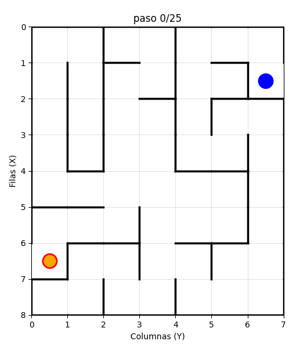
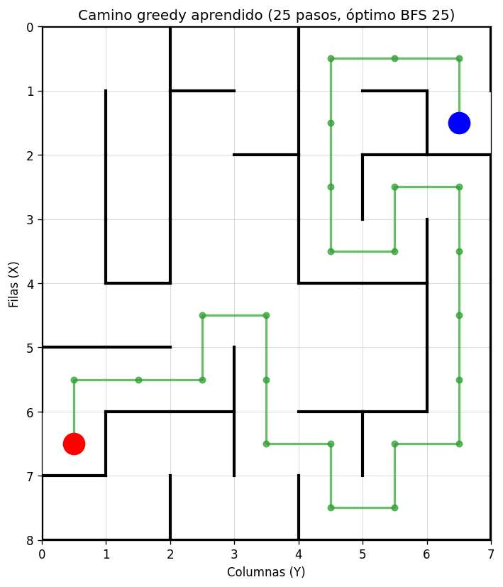
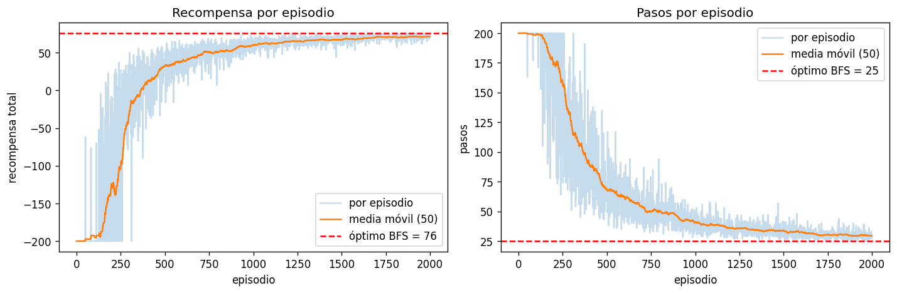

# Q-Learning sobre Laberinto

Agente Q-learning tabular que aprende a navegar un laberinto de 8×7 celdas con muros internos. La política aprendida resuelve el laberinto en 25 pasos, idéntica al camino más corto calculado por BFS sobre el grafo del ambiente.

> Proyecto del curso Aprendizaje por Refuerzo, Universidad de los Andes (semestre 2026-12).

<p align="center">
  
</p>

## Resultados

| Métrica | Agente entrenado | Óptimo (BFS) |
|---|---:|---:|
| Tasa de éxito greedy (100 episodios) | 100 / 100 | 100 / 100 |
| Pasos por episodio | 25 | 25 |
| Recompensa por episodio | +76.0 | +76.0 |
| Estados visitados durante entrenamiento | 55 / 56 | n/a |

La política aprendida coincide **exactamente** con el camino más corto del laberinto.

## El problema

Laberinto rectangular de **8 filas por 7 columnas (56 celdas)** con 37 muros internos que bloquean transiciones entre celdas adyacentes. La geometría se carga desde `data/project_lab_v2.txt` (archivo provisto por el enunciado).

- Celda inicial: `(6, 0)`.
- Celda meta: `(1, 6)`.
- Distancia Manhattan start → goal: 11.
- Camino óptimo (BFS): 25 pasos.

<p align="center">
  
</p>

El agente debe encontrar la trayectoria de mínimo número de pasos, rodeando los muros internos.

## Algoritmo

Q-learning tabular con política $\varepsilon$-greedy. La regla de actualización es:

$$Q(s, a) \leftarrow Q(s, a) + \alpha \left[ r + \gamma \max_{a'} Q(s', a') - Q(s, a) \right]$$

| Componente | Detalle |
|---|---|
| Espacio de estados | $(\text{row}, \text{col}) \in [0, 8) \times [0, 7)$, con $\lvert \mathcal{S} \rvert = 56$ |
| Espacio de acciones | $\{\text{UP}, \text{DOWN}, \text{LEFT}, \text{RIGHT}\}$, con $\lvert \mathcal{A} \rvert = 4$ |
| Recompensa | $+100$ al alcanzar la meta, $-1$ en cualquier otro paso |
| Hiperparámetros | $\alpha = 0.1$, $\gamma = 0.99$, $\varepsilon: 1.0 \to 0.05$ con decay $0.999$ |
| Entrenamiento | 2000 episodios, tope de 200 pasos por episodio |

La caracterización formal completa (estados, acciones con su aplicabilidad explícita, y función de recompensa por situación) está en [`docs/partial.md`](docs/partial.md).

## Curva de aprendizaje

<p align="center">
  
</p>

Tres fases visibles en el entrenamiento:

1. **Caos inicial** (episodios 1 a 300). Exploración con $\varepsilon \approx 1$, recompensa promedio cerca de $-200$.
2. **Aprendizaje rápido** (episodios 300 a 1000). La política greedy emerge y los pasos por episodio bajan de 200 a 44.
3. **Convergencia** (episodios 1000 a 2000). Los pasos asintotan al óptimo BFS de 25, con recompensa estabilizada en $+76$.

## Instalación

```bash
pip install -r requirements.txt
```

Dependencias: `numpy`, `matplotlib`, `pillow`, `jupyter`, `nbconvert`.

## Uso

Los notebooks en `notebooks/` ejecutan todo el flujo end-to-end.

### Modo interactivo

```bash
jupyter notebook notebooks/01_exploration.ipynb
jupyter notebook notebooks/02_experiments.ipynb
```

### Modo headless (regenera artefactos)

```bash
jupyter nbconvert --to notebook --execute notebooks/01_exploration.ipynb --output 01_exploration.ipynb
jupyter nbconvert --to notebook --execute notebooks/02_experiments.ipynb --output 02_experiments.ipynb
```

### Contenido de cada notebook

**`01_exploration.ipynb`**. Carga el laberinto desde el archivo del enunciado, reproduce su visualización, calcula el camino más corto con BFS (referencia para evaluar al agente entrenado) y verifica el ambiente con acciones manuales.

**`02_experiments.ipynb`**. Entrena el agente, persiste la Q-tabla, genera la curva de aprendizaje, evalúa la política greedy en 100 episodios y graba un GIF del comportamiento aprendido.

## Estructura del repositorio

```
Proyecto/
├── data/
│   └── project_lab_v2.txt          Definición del laberinto (enunciado)
├── src/
│   ├── maze.py                     Parser del .txt, geometría y ambiente
│   └── agent.py                    Q-learning tabular con persistencia
├── notebooks/
│   ├── 01_exploration.ipynb        Carga, visualización, BFS, prueba manual
│   └── 02_experiments.ipynb        Training, evaluación, curvas, GIF
├── docs/
│   └── partial.md                  Entrega parcial
├── results/
│   ├── qtable.pkl                  Q-tabla entrenada
│   ├── learning_curve.png          Recompensa y pasos por episodio
│   └── greedy_path.png             Camino aprendido sobre el laberinto
├── video/
│   └── episode_greedy.gif          Demo del agente entrenado
├── requirements.txt
└── _archive/                       Iteraciones previas (referencia histórica)
```

## Entregas

| Entrega | Documento | Contenido |
|---|---|---|
| Parcial (semana 5) | [`docs/partial.md`](docs/partial.md) | Caracterización del problema: conjunto de estados, conjunto de acciones con su aplicabilidad y función de recompensa con valores numéricos por situación. |
| Final | _por anunciar_ | _por definir según consigna del curso_ |
