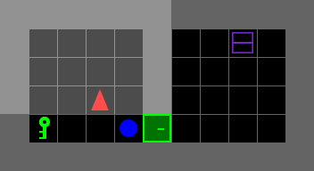
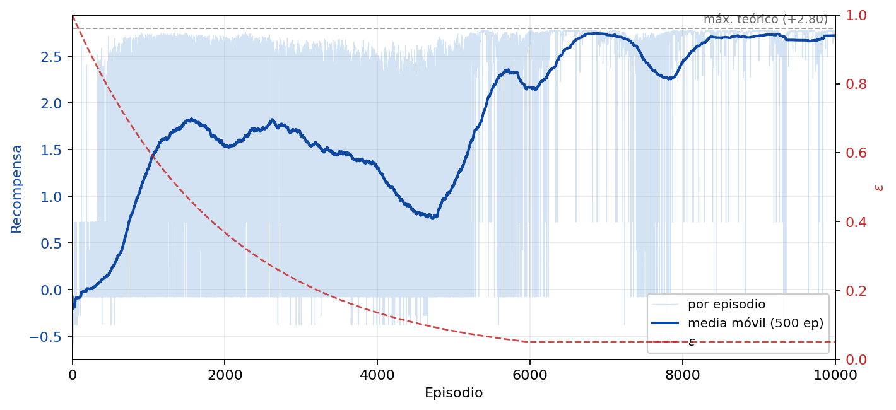
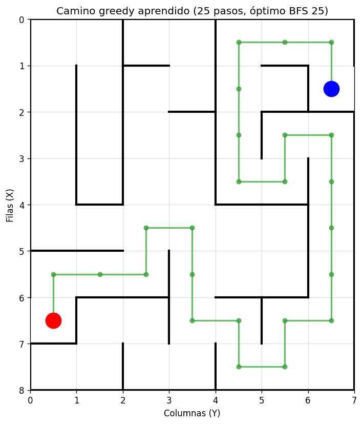

# Q-Learning sobre MiniGrid-BlockedUnlockPickup

Agente Q-learning tabular sobre el ambiente `MiniGrid-BlockedUnlockPickup-v0`. La tarea exige completar una secuencia obligatoria de subtareas — mover una bola que bloquea una puerta, recoger una llave, abrir la puerta, soltar la llave y recoger una caja objetivo — bajo un único inventario. La política aprendida resuelve la tarea de forma consistente con tasa de éxito 100/100.

> Proyecto del curso Aprendizaje por Refuerzo, Universidad de los Andes (semestre 2026-12). Autores: Juan David Lara Camacho, Agustín Serrano.

<p align="center">
  
</p>

## Resultados

| Métrica | Valor |
|---|---:|
| Tasa de éxito greedy (100 episodios) | 100 / 100 |
| Recompensa promedio por episodio | +2.77 |
| Pasos por episodio | ~29 |
| Estados visitados durante entrenamiento | 1421 |
| Episodios de entrenamiento | 10 000 |

La recompensa máxima alcanzable por episodio es +2.80 (suma de bonificaciones por subtarea más recompensa terminal); el agente entrenado se queda a menos de 0.04 de ese máximo. Todas las subtareas se completan en orden óptimo.

## El problema

El ambiente es una grilla con dos cuartos separados por un muro vertical y conectados por una sola casilla con puerta. El agente parte en el cuarto izquierdo y debe recoger una caja objetivo en el cuarto derecho. La puerta está cerrada y necesita una llave del mismo color. Una bola del mismo color bloquea la puerta y debe ser removida primero (no hay acción de empujar: la única forma es `pickup`/`drop`, y el inventario solo admite un objeto a la vez).

La cadena de subtareas obligatorias es:

```
inicio → bola movida → llave en mano → puerta abierta → llave soltada → caja en mano → goal
```

El ambiente es determinista una vez fijada la semilla, pero la combinatoria del estado y las dependencias entre subtareas hacen que la recompensa nativa (`+1` solo al recoger la caja) no entregue señal suficiente para Q-learning tabular: en pruebas iniciales el agente entrenó 10 000 episodios sin recoger la caja una sola vez.

## Algoritmo

Q-learning tabular off-policy con política $\varepsilon$-greedy:

$$Q(s, a) \leftarrow Q(s, a) + \alpha \left[ r + \gamma \max_{a'} Q(s', a') - Q(s, a) \right]$$

| Componente | Detalle |
|---|---|
| Estado $s$ | Tupla de 8 componentes: posición, dirección, objeto cargado, y 5 banderas de progreso (bola movida, llave recogida, puerta abierta, llave soltada, caja recogida). Las 3 últimas banderas hacen que la recompensa sea Markoviana sobre $(s, a, s')$. |
| Acciones $\mathcal{A}$ | `left`, `right`, `forward`, `pickup`, `drop`, `toggle` (las 6 acciones discretas de MiniGrid). |
| Recompensa | Costo por paso $-0.001$ + bonificaciones de *shaping* por subtarea (suma máxima $+1.80$) + recompensa terminal $+1.00$ al recoger la caja. Cada bonificación se entrega una sola vez por episodio. |
| Hiperparámetros | $\alpha = 0.1$, $\gamma = 0.99$, $\varepsilon: 1.0 \to 0.05$ con decay $0.9995$ |
| Entrenamiento | 10 000 episodios, tope de 576 pasos por episodio, semillas fijas (`env_seed=0`, `random_seed=42`) |

### Función de recompensa con shaping

| Evento | Recompensa |
|---|---:|
| Cada paso | −0.001 |
| Mover la bola por primera vez | +0.20 |
| Recoger la llave por primera vez | +0.30 |
| Abrir la puerta por primera vez | +0.50 |
| Soltar la llave (después de abrir) | +0.30 |
| Recoger la caja objetivo | +0.50 |
| Recompensa terminal del ambiente | +1.00 |

La caracterización formal completa (estados, acciones con su aplicabilidad explícita, derivación del shaping, algoritmo, entrenamiento, evaluación y proceso de desarrollo) está en [`docs/final.pdf`](docs/final.pdf).

## Curva de aprendizaje

<p align="center">
  
</p>

Tres fases visibles:

1. **Subida inicial** (≈ ep 1–1500). $\varepsilon$ alto, el agente cubre el espacio de estados y empieza a encadenar las primeras subtareas.
2. **Plateau volátil** (≈ ep 1500–5500). La política domina las primeras subtareas pero no encuentra de forma consistente la secuencia completa; la recompensa oscila.
3. **Convergencia** (≈ ep 5500–10000). $\varepsilon$ ya en su piso de $0.05$. La recompensa sube a la zona del máximo teórico $+2.80$.

## Instalación

```bash
pip install -r requirements.txt
```

Dependencias: `gymnasium`, `minigrid`, `numpy`, `matplotlib`, `pillow`, `jupyter`, `nbconvert`, `opencv-python` (para generar el MP4).

## Uso

### Notebooks (interactivo)

```bash
jupyter notebook notebooks/minigrid/01_exploration.ipynb
jupyter notebook notebooks/minigrid/02_experiments.ipynb
```

- **`notebooks/minigrid/01_exploration.ipynb`** — Carga el ambiente, inspecciona el espacio de estados/acciones, ejecuta acciones manuales para validar el shaping de recompensa.
- **`notebooks/minigrid/02_experiments.ipynb`** — Entrena el agente desde cero, persiste la Q-tabla, evalúa greedy en 100 episodios y graba un GIF.

### Scripts (headless)

```bash
# Entrenamiento + artefactos (qtable, curve, gif). Toma ~18 min.
python scripts/verify_minigrid.py

# Evaluación con varias estrategias (greedy puro con distintos seeds, cuasi-greedy)
python scripts/stress_test.py

# Regenera figuras pulidas (curvas con sombreado de fases, frames semánticos, GIF/MP4 HD)
python scripts/polish_figures.py

# Genera las figuras de docs/partial.tex (artefactos históricos del parcial)
python scripts/build_figures.py
```

## Trabajo adicional: laberinto rectangular 8×7

En el foro del curso se planteó como ejemplo un laberinto rectangular $8 \times 7$ con muros internos. Lo trabajamos en paralelo al ambiente principal porque sirve como sanity check limpio: la solución óptima se obtiene de forma exacta con BFS, lo que da un punto de referencia objetivo para comparar la política aprendida.

| Métrica | Agente entrenado | Óptimo (BFS) |
|---|---:|---:|
| Tasa de éxito greedy (100 episodios) | 100 / 100 | 100 / 100 |
| Pasos por episodio | 25 | 25 |
| Recompensa por episodio | +76.0 | +76.0 |

El laberinto tiene 56 celdas, 37 muros internos, start `(6, 0)` y goal `(1, 6)`. La distancia Manhattan start→goal es 11 pero los muros fuerzan un camino mínimo de 25 pasos. Las acciones son `{UP, DOWN, LEFT, RIGHT}` y la recompensa es la canónica de gridworld (+100 al alcanzar la meta, −1 en cualquier otro paso).

<p align="center">
  
</p>

Notebooks: [`notebooks/maze/01_exploration.ipynb`](notebooks/maze/01_exploration.ipynb) (carga, BFS, prueba manual) y [`notebooks/maze/02_experiments.ipynb`](notebooks/maze/02_experiments.ipynb) (entrenamiento, evaluación, GIF). Geometría provista por el enunciado en [`data/project_lab_v2.txt`](data/project_lab_v2.txt). El laberinto también figura como Apéndice A en `docs/final.tex`.

## Estructura del repositorio

```
Proyecto/
├── data/
│   └── project_lab_v2.txt          Definición del laberinto (enunciado)
├── src/
│   ├── agent.py                    Q-learning tabular genérico (save/load)
│   ├── minigrid/
│   │   └── env.py                  Wrapper de MiniGrid-BlockedUnlockPickup-v0
│   └── maze/
│       └── env.py                  Parser y ambiente del laberinto 8×7
├── notebooks/
│   ├── minigrid/
│   │   ├── 01_exploration.ipynb
│   │   └── 02_experiments.ipynb
│   └── maze/
│       ├── 01_exploration.ipynb
│       └── 02_experiments.ipynb
├── scripts/
│   ├── verify_minigrid.py          Entrenamiento headless + artefactos
│   ├── stress_test.py              Evaluación con múltiples estrategias
│   ├── polish_figures.py           Regenera figuras pulidas (curvas, frames, GIF/MP4 HD)
│   └── build_figures.py            Figuras históricas para docs/partial.tex
├── results/
│   ├── minigrid/
│   │   ├── qtable.pkl
│   │   ├── learning_curve.png
│   │   ├── episode_greedy.gif
│   │   └── episode_greedy.mp4
│   └── maze/
│       ├── qtable.pkl
│       ├── learning_curve.png
│       ├── greedy_path.png
│       ├── episode_greedy.gif
│       └── episode_greedy.mp4
├── docs/
│   ├── final.tex                   Entrega final (LaTeX)
│   ├── final.pdf                   Entrega final (PDF compilado)
│   ├── partial.tex                 Entrega parcial (LaTeX)
│   ├── partial.md                  Entrega parcial (Markdown)
│   └── figures/                    Figuras compiladas en final.tex y partial.tex
├── PARCIAL-Proyecto_*.pdf          Entrega parcial submitida (semana 5)
├── requirements.txt
└── README.md
```

## Entregas

| Entrega | Documento | Contenido |
|---|---|---|
| Parcial (semana 5) | [`docs/partial.tex`](docs/partial.tex) → [PDF](PARCIAL-Proyecto_JuanLara-AgustinSerrano.pdf) | Caracterización formal del ambiente: estados (8 componentes con justificación), acciones con su aplicabilidad y función de recompensa con shaping. Apéndice con el laberinto 8×7. |
| Final (semana 8) | [`docs/final.tex`](docs/final.tex) → [`docs/final.pdf`](docs/final.pdf) | Documento standalone: formulación MDP completa, algoritmo, entrenamiento (curva con sus tres fases), evaluación greedy (100/100, +2.77, 29 pasos) y robustez frente a varias estrategias, proceso de desarrollo, compromiso entre representaciones de 5 y 8 componentes, conclusiones. Apéndice con el laberinto. |

### Artefactos de la entrega final

| Artefacto | Ruta |
|---|---|
| Video del agente entrenado | [`results/minigrid/episode_greedy.mp4`](results/minigrid/episode_greedy.mp4) (y [`.gif`](results/minigrid/episode_greedy.gif)) |
| Q-tabla entrenada | [`results/minigrid/qtable.pkl`](results/minigrid/qtable.pkl) (1416 estados aprendidos) |
| Código del agente con save/load | [`src/agent.py`](src/agent.py) — `QLearningAgent.save()` / `QLearningAgent.load()` |
| Código del ambiente | [`src/minigrid/env.py`](src/minigrid/env.py) |
| Script de entrenamiento headless | [`scripts/verify_minigrid.py`](scripts/verify_minigrid.py) |
| Script de evaluación robusta | [`scripts/stress_test.py`](scripts/stress_test.py) |

Para cargar la Q-tabla entrenada y ejecutar un episodio greedy:

```python
from src.minigrid.env import DoorKeyEnv
from src.agent import QLearningAgent

env = DoorKeyEnv(seed=0)
agent = QLearningAgent.load("results/minigrid/qtable.pkl")
state, _ = env.reset()
for _ in range(576):
    state, _, terminated, truncated, _ = env.step(agent.greedy_action(state))
    if terminated or truncated:
        break
```
